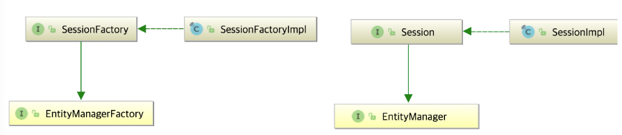

# 엔티티 매니저 팩토리
- 책을 읽다가 문득 내부가 궁금해서 살짝 끄적여본다.
  우선 팩토리를 만드는 방법은 다음과 같다.
```
EntityManagerFactory entityManagerFactory = Persistence.createEntityManagerFactory("jpabook");
```

<br>

- createEntityManagerFactory()에서 resolver를 얻어오는데 해당 리졸버는 HibernatePersistenceProvider이다.
```
PersistenceProviderResolver resolver = PersistenceProviderResolverHolder.getPersistenceProviderResolver();
```

<br>

- HibernatePersistenceProvider가 하는 역할이 무엇인지 살펴보니
    - persistenct.xml을 읽어 설정 정보들을 map으로 보관하고 해당 정보들을 이용하여 EntityManagerFactory를 만드는 빌더를 만드는 역할을 수행하고 있었다.
```
// HibernatePersistenceProvider.createEntityManagerFactory()

public EntityManagerFactory createEntityManagerFactory(String persistenceUnitName, Map properties) {
    final EntityManagerFactoryBuilder builder = getEntityManagerFactoryBuilderOrNull( persistenceUnitName, properties );
    ...
    return builder.build();
}
```

<br>

- build() 내부에서는 SessionFactory를 통해 엔티티 매니저 팩토리를 생성한다.
```text
final SessionFactoryBuilder sfBuilder = metadata().getSessionFactoryBuilder();
final EntityManagerFactory emf = sfBuilder.build();
```

<br>

- 위 과정을 요약하면 엔티니 매니저 팩토리를 생성하는 과정은 JPA API 명세들이 구현된 [하이버네이트](https://docs.jboss.org/hibernate/orm/current/userguide/html_single/Hibernate_User_Guide.html#architecture)의 구현체를 통해 가져온다.
- 세션 팩토리는 다이어그램에서 살펴볼 수 있듯이 JPA의 EntityManagerFactory의 명세가 적힌 인터페이스이며 구현체(SessionFactoryImpl)를 통해 엔티티 매니저 팩토리를 생성할 수 있게 된다.
  - Every SessionFactory is a JPA EntityManagerFactory



```text
A thread-safe (and immutable) representation of the mapping of the application domain model to a database.
...
A SessionFactory is very expensive to create, so, for any given database, the application should have only one associated SessionFactory
```
- 하이버네이트의 세션 팩토리는 도메인 모델을 데이터베이스에 매핑하는 스레드 세이프한 놈이다.
- 문서에도 세션 팩토리(=엔티티 매니저 팩토리)를 만드는데 비싸다고 하는데 이 과정까지 오는데 클래스 로더라든가 부트스트랩 등 시스템 자원을 많이 소모한 것 같아 왜 비싼지 알 것 같기도 하다.

<br>

- 결론은 JPA가 Java Persistence `Api` 라고 하는데 왜 API 명세서인지 엔티티 매니저 팩토리를 통해 조금이나마 느끼게 되었다.
- 엔티티 매니저 팩토리는 하이버네이트 세션 팩토리를 통해 생성된다.
- 엔티티 매니저 팩토리는 쓰레드에 안전하며
- 엔티티 매니저 팩토리(= 세션 팩토리) 하나 생성하는데 매우 비싼 비용이 소모된다고 한다.
- 어플리케이션은 하나의 앤티티 매니저 팩토리 인스턴스를 가지고 있다.